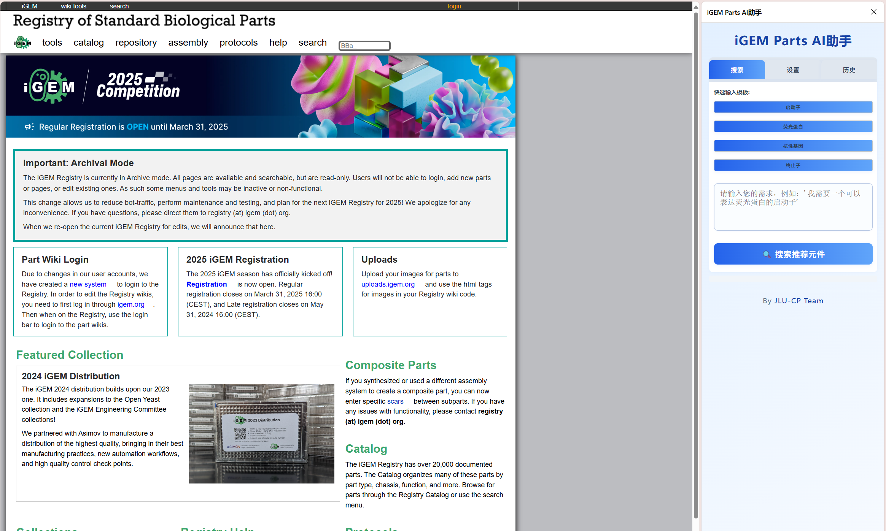

# iGEM Parts AI助手

## 项目简介
一款基于多模型、支持中英双语、可一键推荐最贴合需求生物元件的浏览器智能插件。


---

## 主要亮点
- 多主流AI模型支持（DeepSeek、讯飞星火、豆包、OpenAI、Hugging Face、Ollama等）
- 部分模型内置免费API Key，免注册直接体验
- 中英双语界面与推荐理由一键切换
- 现代美观UI，侧边栏持久化，历史记录智能保存
- 推荐理由和建议更贴合需求，底部团队主页超链接

---

## 安装与使用全流程

### 1. 从GitHub拉取项目
```bash
git clone https://github.com/Keith9922/iGEM-Parts-AI.git
cd igem-parts-ai
```

### 2. 加载插件到浏览器
#### Chrome/Edge：
1. 打开 `chrome://extensions/`
2. 开启右上角“开发者模式”
3. 点击“加载已解压的扩展程序”
4. 选择本项目文件夹

#### Firefox：
1. 打开 `about:debugging`
2. 选择“此 Firefox”
3. 点击“临时载入附加组件”
4. 选择 `manifest-firefox.json`

### 3. 首次设置
1. 打开 [iGEM Parts Registry](https://parts.igem.org/)
2. 点击浏览器工具栏插件图标，选择侧边栏打开，右侧侧边栏自动弹出
3. 进入“设置”页：
   - 选择AI模型（如DeepSeek体验可直接用，OpenAI等需填API Key）
   - 选择模型类型（如gpt-3.5-turbo、deepseek-chat等）
   - 保存设置

### 4. 使用AI推荐元件
1. 切换到“搜索”页
2. 可用快速模板一键填入常用需求，或手动输入如“我需要一个高效表达的启动子”
3. 按回车或点“搜索推荐元件”
4. 稍等片刻，AI将返回最贴合需求的元件推荐、理由和使用建议（中英可切换）
5. 点击元件名称可跳转到iGEM官网对应页面

### 6. 历史记录与复用
- 插件自动保存最近100次对话
- “历史”页可查看、复用、对比以往查询结果，无需重复API请求

### 7. 常见问题
- 体验Key额度有限，超限后请切换正式版并填写自己的Key
- 推荐结果仅供参考，请结合专业知识判断
- 如遇API失效、额度用尽、网络异常等，界面会有友好提示
- 支持多浏览器，建议用最新版Chrome体验最佳

---

## 团队主页与联系方式
- 团队主页：[https://2025.igem.wiki/JLU-CP/](https://2025.igem.wiki/JLU-CP/)

如有建议、合作或定制需求，欢迎在GitHub提交Issue或通过团队主页联系！ 
